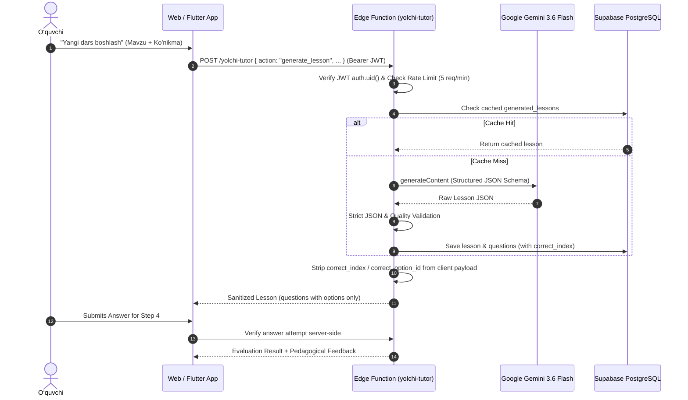

# BILIMYO‘L SMART EDU - REAL GEMINI LESSON GENERATION AUDIT
**Date:** 2026-08-17  
**Status:** In Progress / Implementation Plan  
**Target Model:** `gemini-3.6-flash` (Centralized Configuration)

---

## 1. Executive Summary & Goals

The objective is to upgrade BilimYo‘l Smart Edu's existing AI Tutor architecture into a **full-scale, production-ready, real AI Lesson Generation system** powered by Google Gemini (`gemini-3.6-flash`).

### Core Requirements:
1. **Server-Side API Key Security:** `GEMINI_API_KEY` exists strictly within Supabase Edge Function environment secrets (`Deno.env.get('GEMINI_API_KEY')`). Zero exposure in Web, Flutter, GitHub, or client bundles.
2. **Authenticated Access:** All lesson generation requests require verified Supabase Auth JWT (`auth.uid()`).
3. **Structured Lesson & Question Generation:** Gemini generates rich Uzbek pedagogical lessons with concepts, formulas/rules, step-by-step examples, and 5 interactive multiple-choice questions.
4. **Anti-Cheat Answer Security:** The client receives questions **without** `correct_index` / `correct_option_id`. All answer evaluation is verified server-side.
5. **Validation & Quality Control:** Edge Function validates AI outputs for JSON schema integrity, exactly 4 distinct options, valid answer index, and absence of spoiler texts.
6. **Caching & Rate Limiting:** Deduplication and database caching on `(course_id, skill_id, topic, level, difficulty)` to control AI costs. 5 requests/min rate limit per user.
7. **Adaptive Personalization:** Prompt difficulty dynamically adapts to learner mastery score in `learner_skill_scores`.
8. **Web + Flutter Parity:** Both clients interact with the exact same Supabase Edge Function (`yolchi-tutor`).

---

## 2. Existing Architecture vs Required Enhancements

| Component | Current State | Target State |
|---|---|---|
| **Supabase Edge Function** (`yolchi-tutor`) | Handles `diagnose_mistake`, `generate_question`, `generate_reinforcement` | Adds `generate_lesson` action with full structured schema, token monitoring, caching, and auth validation |
| **Gemini Model** | `gemini-3.6-flash` configured in Edge Function | Centralized model resolution with robust JSON schema mode (`responseMimeType: "application/json"`) |
| **Database Schema** | `courses`, `skills`, `questions`, `lesson_progress` | Adds `generated_lessons` table with RLS and caching index |
| **Answer Security** | Strips `correctIndex` on single questions | Strips `correctIndex` on all lesson interactive questions before sending to client |
| **Web Service Layer** | `GeminiAITutorService` has diagnosis & question gen | Exposes `generateLesson()` and integrates with `useLessonStore` |
| **Flutter Service Layer** | `SupabaseAITutorService` has diagnosis | Exposes `generateLesson()` calling `yolchi-tutor` |
| **User Interface** | Static seed lessons | Interactive "Yangi AI Darsi" button generating real adaptive lessons |

---

## 3. Database Schema Design: `public.generated_lessons`

```sql
CREATE TABLE IF NOT EXISTS public.generated_lessons (
  id TEXT PRIMARY KEY,
  course_id TEXT NOT NULL REFERENCES public.courses(id) ON DELETE CASCADE,
  skill_id TEXT NOT NULL REFERENCES public.skills(id) ON DELETE CASCADE,
  topic TEXT NOT NULL,
  level TEXT NOT NULL DEFAULT 'intermediate',
  difficulty TEXT NOT NULL DEFAULT 'medium',
  title TEXT NOT NULL,
  summary TEXT NOT NULL,
  objective TEXT NOT NULL,
  estimated_minutes INT NOT NULL DEFAULT 15,
  steps JSONB NOT NULL,
  questions JSONB NOT NULL,
  generation_model TEXT NOT NULL DEFAULT 'gemini-3.6-flash',
  created_by UUID REFERENCES auth.users(id) ON DELETE SET NULL,
  created_at TIMESTAMPTZ NOT NULL DEFAULT now(),
  updated_at TIMESTAMPTZ NOT NULL DEFAULT now()
);

CREATE INDEX IF NOT EXISTS idx_gen_lessons_lookup 
  ON public.generated_lessons(course_id, skill_id, topic, level, difficulty);
```

---

## 4. Anti-Cheat & Answer Verification Flow



---

## 5. Implementation Roadmap & Verification Plan

1. **Database Migration:** Create `supabase/migrations/20260817000011_real_gemini_lesson_generation.sql` for `generated_lessons` table and RLS policies.
2. **Edge Function Hardening:** Implement `generate_lesson` in `supabase/functions/yolchi-tutor/index.ts`.
3. **Web Domain & Service Layer:** Update `IAITutorService.ts`, `GeminiAITutorService.ts`, `useLessonStore.ts`, and `InteractiveLessonView.tsx`.
4. **Flutter Domain & Service Layer:** Update `supabase_ai_tutor_service.dart`.
5. **Comprehensive Testing:** Add Vitest and Flutter tests verifying valid generation, validation failures, rate limits, answer stripping, and error fallback.
6. **Quality Gate:** Run TypeScript check, linter, production build, and Flutter tests.
