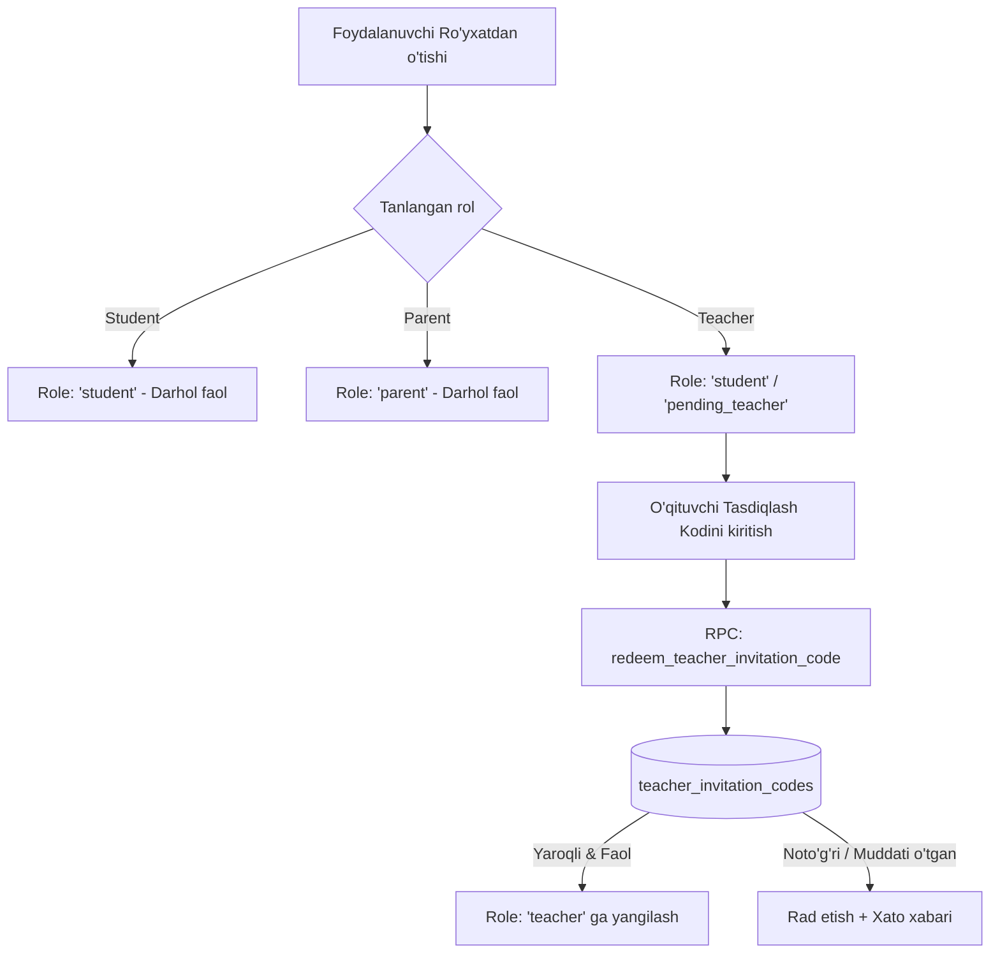

# BILIMYO‘L SMART EDU — PRODUCTION ROLE & ACCESS CONTROL IMPLEMENTATION PLAN

## 1. Joriy Holat va Muammo Tahlili (Current Architecture & Root Cause)

### 1.1 Rollar Holati
* **O‘quvchi (Student):** Standart ro‘yxatdan o‘tadi, o‘quv faoliyati, bilim xaritasi va yo‘l xaritasiga ega.
* **Ota-ona (Parent):** Standart ro‘yxatdan o‘tadi, 6 xonali kod orqali farzandini bog‘laydi va pedagogik tahlilni ko‘radi.
* **O‘qituvchi (Teacher):** O‘zboshimchalik bilan ro‘yxatdan o‘tishi mumkin emas; faqat **Server-tomonidan tasdiqlangan maxsus Taklif/Tasdiqlash Kodi (`teacher_invitation_codes`)** orqali `teacher` roliga ko‘tarilishi shart.

### 1.2 Topilgan Muammolar va Xavflar
1. **O‘qituvchi roliga o‘zboshimchalik bilan o‘tish xavfi (Privilege Escalation):**
   Avvalgi versiyada foydalanuvchi ro‘yxatdan o‘tishda shunchaki "O‘qituvchi" tugmasini tanlab o‘qituvchiga aylana olar edi. Bu maktab va sinf ma'lumotlari xavfsizligiga tahdid soladi.
2. **O‘qituvchi aktivatsiyasi uchun server-side kod tizimi yo‘qligi:**
   O‘qituvchini tekshirish va tasdiqlash uchun alohida `teacher_invitation_codes` jadvali va xavfsiz `redeem_teacher_invitation_code` RPC funksiyasi mavjud emas edi.
3. **Sessiyalar almashinuvida kesh izolyatsiyasi:**
   Bitta brauzerda o‘quvchi chiqib, o‘qituvchi yoki ota-ona kirganda do‘kon (store) holatlari to‘liq tozalanmasligi natijasida stale ma'lumotlar ko‘rinish ehtimoli.

---

## 2. Taklif Qilinayotgan Yakuniy Arxitektura (Target Architecture)

---

## 3. Database Migratsiyasi (`20260817000005_teacher_invitation_codes.sql`)

1. **`public.teacher_invitation_codes` jadvali:**
   - `id` (UUID PK)
   - `code` (TEXT UNIQUE) — Masalan: `USTOZ-2026-ALPHA`, `BILIM-TEACHER-77`
   - `school_name` (TEXT)
   - `created_by` (UUID)
   - `max_uses` (INT DEFAULT 10)
   - `used_count` (INT DEFAULT 0)
   - `expires_at` (TIMESTAMPTZ)
   - `is_active` (BOOLEAN DEFAULT TRUE)
   - `created_at`, `updated_at`
2. **`public.redeem_teacher_invitation_code(p_code TEXT)` RPC:**
   - `SECURITY DEFINER` rejimida ishlaydi.
   - `auth.uid()` ni tekshiradi.
   - Kodni solishtiradi (`UPPER(TRIM(p_code))`).
   - Kod faol, muddati o‘tmagan va `used_count < max_uses` ekanini tekshiradi.
   - `public.profiles.role` ni `'teacher'` ga yangilaydi.
   - `used_count` ni 1 ga oshiradi.
   - Audit yozuvini qaytaradi.
3. **Mavjud RPC'lar va RLS politsiyalarini mustahkamlash.**

---

## 4. Frontend & Mobile O‘zgarishlari

1. **`RegisterView.tsx` & `TeacherActivationModal.tsx`:**
   - Agar foydalanuvchi "O‘qituvchi" sifatida hisob ochsa, to‘g‘ridan-to‘g‘ri tasdiqlash kodini so‘raydi yoki "O‘qituvchi faollashtirish kodi" maydonini tekshiradi.
   - Yaroqsiz kod kiritilganda darhol aniq o‘zbekcha xatolik beradi: *"O‘qituvchi tasdiqlash kodi noto‘g‘ri yoki muddati tugagan."*
2. **`AuthContext.tsx` & `useMonitoringStore.ts`:**
   - Tizimdan chiqishda (`signOut`), barcha storelar (`useMonitoringStore`, `useLearnerStore`, `useCourseStore`) to‘liq `resetAll()` qilinadi.
   - `redeemTeacherCode(code)` action qo‘shiladi.
3. **`Navbar.tsx` & `AppRouter.tsx`:**
   - Qat'iy Role Guard: `student` $\to$ faqat o‘quvchi sahifalari, `parent` $\to$ faqat ota-ona sahifasi, `teacher` $\to$ faqat o‘qituvchi sahifasi.
4. **Flutter Parity:**
   - Flutter `in_memory_monitoring_repository.dart` va domain interfeyslariga `redeemTeacherInvitationCode` qo‘shiladi.

---

## 5. Test va Sifat Nazorati (Test Strategy)

* **Unit & Security Tests:**
  - O‘quvchi ro‘yxatdan o‘tganda `student` bo‘lishini tekshirish.
  - Ota-ona ro‘yxatdan o‘tganda `parent` bo‘lishini tekshirish.
  - O‘qituvchi noto‘g‘ri kod bilan `teacher` bo‘la olmasligini tekshirish.
  - O‘qituvchi to‘g‘ri kod (`USTOZ-2026-ALPHA`) bilan muvaffaqiyatli `teacher` roliga o‘tishini tekshirish.
  - O‘quvchi ota-ona yoki o‘qituvchi paneliga kira olmasligini tekshirish.
* **Web Build:** `npm run typecheck`, `npm run lint`, `npx vitest run`, `npm run build`.
* **Flutter Build:** `flutter analyze --no-pub`, `flutter test`, `flutter build apk --release`.
